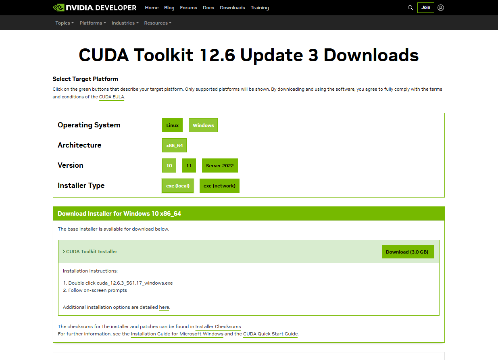
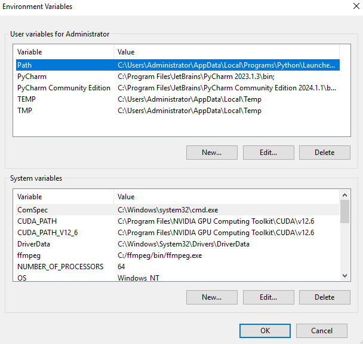
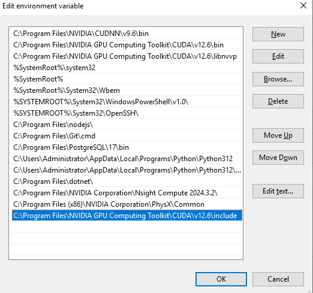
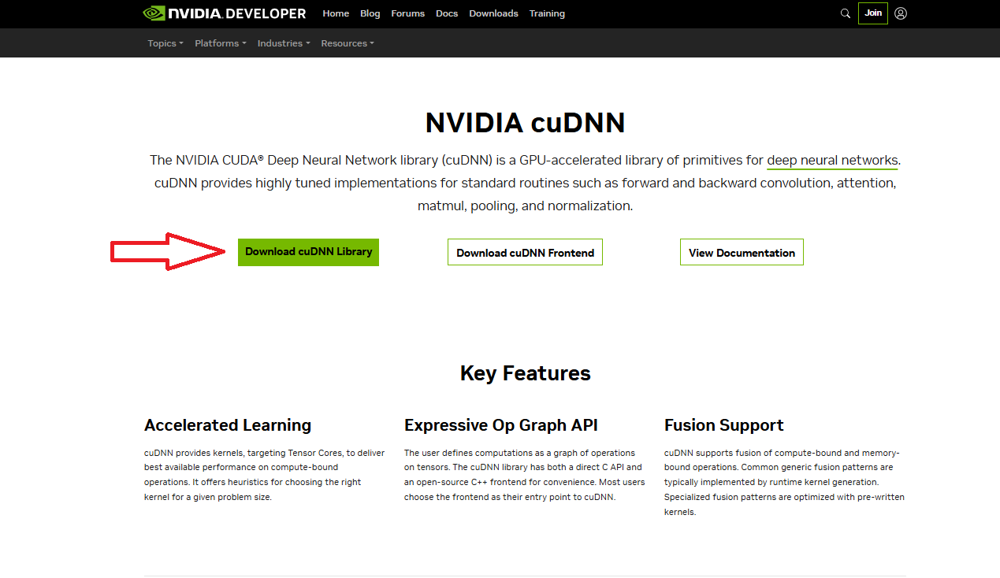
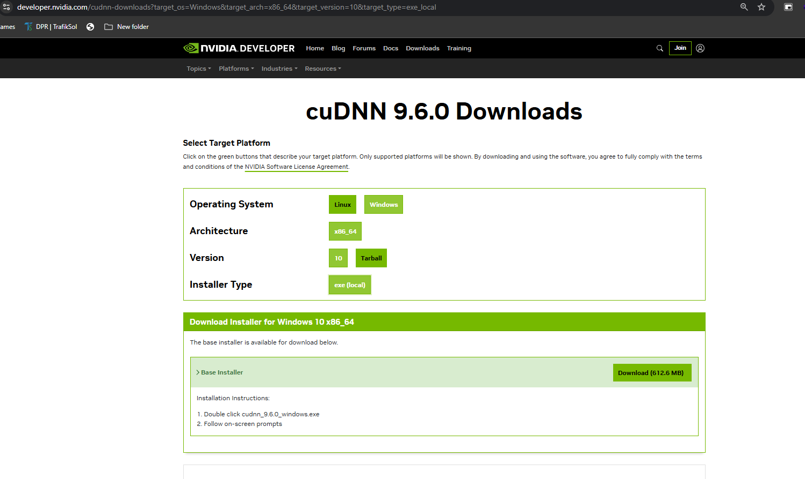

# **How to Install NVIDIA GPU for Object Detection, CUDA Toolkit, and cuDNN**
This documentation provides a comprehensive guide for installing the NVIDIA GPU, CUDA Toolkit, cuDNN, and diagnosing issues like "CUDA not available," specifically for the NVIDIA RTX A4000 or similar GPUs.

## 1. **Check if the NVIDIA Driver is Installed and Working**
Before installing the CUDA toolkit, make sure that the NVIDIA driver is installed and functioning.

### Steps:
- Open your terminal or command prompt.
- Run the following command:
  ```bash
  nvidia-smi
  ```
- **If the output shows GPU details**, your NVIDIA driver is installed and working fine.
- **If it returns an error**, you need to install or update the driver. Download the latest driver from the [NVIDIA Driver Download Page](https://www.nvidia.com/en-us/drivers/).

## 2. **Verify CUDA Toolkit Installation**
You must have a compatible CUDA Toolkit installed. Verify the installation using the following command:

- Run the following in your terminal:
  ```bash
  nvcc --version
  ```
- **If the CUDA version is displayed**, the toolkit is installed.
- If the command is not recognized, download and install the CUDA Toolkit from [CUDA Toolkit Downloads](https://developer.nvidia.com/cuda-downloads).

### Install the CUDA Toolkit:
To install the CUDA Toolkit:
1. Visit the [CUDA Toolkit Download Page](https://developer.nvidia.com/cuda-downloads).
2. Select the appropriate version (e.g., CUDA 12.0) for your system.
3. Follow the installation instructions for your operating system.

#### Windows Installation Steps:
1. Download the `.exe` installer for your version (e.g., Windows 10/11).
2. Run the installer and agree to the license agreement.
3. Choose **Express** installation (recommended).
4. Install CUDA Toolkit, NVIDIA Driver (if not already installed), CUDA Samples, and Nsight tools.
5. Restart your computer after the installation.



## 3. **Add CUDA Toolkit to Environment Variables**
Ensure the CUDA Toolkit is properly configured in your system’s `PATH` environment variable.

### Steps:
1. Press `Win + R`, type `sysdm.cpl`, and press Enter.
2. Go to the **Advanced** tab, click **Environment Variables**.
3. In the **System Variables** section, find the `Path` variable and click **Edit**.
4. Add the following paths (modify based on your installation directory):
   ```
   C:\Program Files\NVIDIA GPU Computing Toolkit\CUDA\v12.0\bin
   C:\Program Files\NVIDIA GPU Computing Toolkit\CUDA\v12.0\libnvvp
   C:\Program Files\NVIDIA GPU Computing Toolkit\CUDA\v12.0\include
   ```
5. Click **OK** to save the changes.

## 4. **Verify Installation**
After installing CUDA, confirm its installation:

### Steps:
1. Run the following command to check the CUDA version:
   ```bash
   nvcc --version
   ```
2. To verify GPU recognition, run:
   ```bash
   nvidia-smi
   ```


## 5. **Install cuDNN (Optional but Recommended)**
cuDNN is a GPU-accelerated library for deep neural networks, crucial for deep learning frameworks like PyTorch and TensorFlow.

### Steps:
1. Visit the [cuDNN Download Page](https://developer.nvidia.com/cudnn).
2. Download the version compatible with your installed CUDA version.
3. Extract the downloaded `.exe` and copy the contents (bin, include, and lib folders) to the corresponding directories in:
   ```
   C:\Program Files\NVIDIA GPU Computing Toolkit\CUDA\v12.0
   ```




## 6. **Install PyTorch with GPU Support**
To enable GPU support with PyTorch, install the version compatible with your CUDA installation.

### Steps:
1. Check the installed PyTorch version:
   ```bash
   pip show torch
   ```

2. If necessary, uninstall the current version:
   ```bash
   pip uninstall torch torchvision torchaudio -y
   ```

3. Reinstall PyTorch with GPU support:
   - For CUDA 12.1 (recommended):
     ```bash
     pip install torch torchvision torchaudio --index-url https://download.pytorch.org/whl/cu121
     ```
   - For CUDA 12.0:
     ```bash
     pip install torch torchvision torchaudio --index-url https://download.pytorch.org/whl/cu120
     ```
   - For CUDA 11.8:
     ```bash
     pip install torch torchvision torchaudio --index-url https://download.pytorch.org/whl/cu118
     ```
   
   Reference: [PyTorch](https://pytorch.org/)

## 7. **Verify PyTorch GPU Availability**
To check if PyTorch is using the GPU, use the following code:

```python
import torch
print(f"Is CUDA available: {torch.cuda.is_available()}")
print(f"CUDA version supported by PyTorch: {torch.version.cuda}")
print(f"CUDA is available. Number of GPUs: {torch.cuda.device_count()}")
print(f"Current CUDA device: {torch.cuda.current_device()}")
print(f"CUDA device name: {torch.cuda.get_device_name(torch.cuda.current_device())}")
```

**Expected output**:
```
Is CUDA available: True
CUDA version supported by PyTorch: 12.1
CUDA is available. Number of GPUs: 2
Current CUDA device: 0
CUDA device name: NVIDIA RTX A4000
```

## 8. **Troubleshooting**
If the above steps don't resolve the issue, consider the following:

- Ensure that your CUDA version is compatible with the GPU driver and the PyTorch version. Check the [PyTorch Compatibility Chart](https://pytorch.org/get-started/previous-versions/) for supported versions.
- If using CUDA 12.x, ensure that PyTorch binaries for this version are available. PyTorch officially supports CUDA 12.0 and 12.1.
  
### Important Notes:
- **PyTorch Binaries for CUDA 12.4**: As of this writing, CUDA 12.4 may not be fully supported by PyTorch. It is advisable to use CUDA 11.8 or 12.1 for better compatibility.
- Avoid using experimental or unsupported versions of PyTorch, as this can lead to runtime errors or suboptimal performance.

---

This documentation can be shared in your GitHub repository as part of your project’s setup guide. You can also include links to official resources to ensure users can access the latest versions of drivers and tools.
